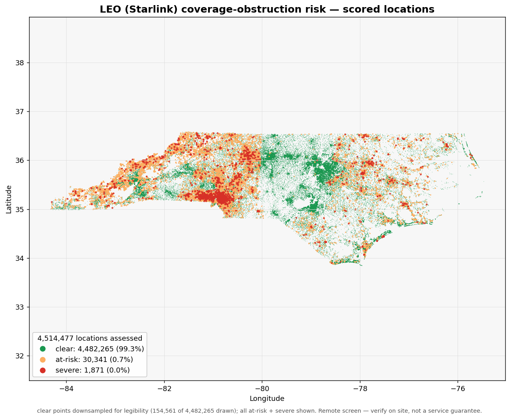

# LEO Satellite Coverage Risk Analysis

An **agent-driven geospatial data pipeline** that identifies locations inside a LEO
satellite provider's service footprint whose connectivity is likely degraded by
environmental obstructions — tree canopy, terrain, and structures.

Submission for the Ready Builders Challenge
([issue #50](https://github.com/ready/builders-challenge/issues/50)).

## Status

Methodology, Starlink reception geometry, and tuneable parameters documented
(`docs/rationale.md`); de-duplication + tiling, the **A1 data-discovery agent** (live STAC
search → ranked data manifest), and the **A2 surface-ingestion agent** (live windowed COG
read → reproject → fused pseudo-DSM per tile), and the **A3 analysis agent** (live
per-azimuth horizon profile → dwell-weighted obstruction % → `clear`/`at_risk`/`severe`/
`undetermined` tier, plus a "find a clearer spot / mast height" search), the **A4
validation/QA agent** (live input-quality audit + output-anomaly scan → an H2 review verdict),
and the **A5 reporting agent** (live county/state aggregates + an interactive PMTiles/MapLibre
risk map + an officer-facing decision log) are **all live** — the full Orchestrator + A1–A5
design is now wired into `src/`. Standalone `leo-discovery` / `leo-tiling` / `leo-ingestion` /
`leo-analysis` / `leo-qa` / `leo-report` CLIs and a deterministic `tests/` suite (offline;
opt-in live tests); each agent's `--compute` path runs the same deterministic engine without an
API call. As of 2026-06-04 the full A2→A3→A4→A5 chain has also been **driven live, LLM in
the loop** (Claude Agent SDK, Opus driver / Sonnet workers) on a real central-NC tile — the
agentic path, not just the deterministic engine, is now verified end-to-end. Remaining work is
the documented in-role deferrals (A2 buildings/cover-proxy, A3 σ_H/TLE weighting), not missing
roles. See the [decision log](#decision-log).

## Insights

A full-dataset run (all **4,514,477** unique coordinates behind the 4.67M funded locations,
North Carolina) scored:

| Risk tier | Locations | Share |
|-----------|----------:|------:|
| 🟢 clear | 4,482,265 | 99.3% |
| 🟡 at-risk (marginal) | 30,341 | 0.7% |
| 🔴 severe | 1,871 | 0.0% |
| ⚪ undetermined | 0 | 0.0% |

Household-weighted, **~0.7%** of North Carolina locations (≈32.8K households) are at-risk.
The risk concentrates in the western Blue Ridge terrain and dense-canopy counties — the
priority county is **Mecklenburg (FIPS 37119, ~8.3K at-risk households)**, with the highest
*rate* in smaller mountain counties (e.g. 37115 at 5.4%).



**Read it as a prioritised verify-on-site list, not a service guarantee** — 42.8% of scores
are low-confidence (DEM-fill / pseudo-DSM surfaces dominate) and the 🟡/🔴 cut-points are
calibration defaults that should be tuned against the Starlink app on a labelled sample first.

- Officer-facing summary: [`outputs/decision_log.md`](outputs/decision_log.md)
- County + state rollups (JSON): [`outputs/aggregates.json`](outputs/aggregates.json)
- Interactive map: [`outputs/coverage_map.html`](outputs/coverage_map.html) (MapLibre +
  `outputs/locations.pmtiles`; serve the `outputs/` folder over a static server — e.g.
  `python -m http.server` — then open it; the PNG above is the zero-setup offline view)

Regenerate with `leo-report --compute` (or `scripts/make_static_map.py` for the PNG).

## Layout

```
docs/        architecture, rationale, data-sources (+ Mermaid diagram)
src/leo_pipeline/
  config.py        models, paths, env loading; Discovery (A1) + Ingestion (A2) + Analysis (A3) + QA (A4) + Reporting (A5) knobs
  orchestrator.py  wires tools + agents into Claude Agent SDK options
  ingest.py        deterministic input profiling + coordinate de-duplication (pre-step)
  tiling.py        deterministic UTM tiling of the unique-coordinate work list (pre-step)
  horizon.py       deterministic per-azimuth horizon / obstruction engine (A3 core)
  qa.py            deterministic input-quality + output-anomaly engine (A4 core)
  report.py        deterministic aggregation + PMTiles/MapLibre map + decision-log engine (A5 core)
  run_discovery.py / run_ingestion.py / run_analysis.py / run_qa.py / run_report.py   standalone A1–A5 CLIs
  agents/          data-discovery (A1) · ingestion (A2) · geo-analysis (A3) · qa (A4) · reporting (A5) (least-privilege)
  tools/           @tool defs + in-process SDK MCP server ("leo")
  state/           PipelineState (+ SurfaceTile, ObstructionResult, QAAnomaly, ReportArtifact) threaded between agents
  run_full.py / offline.py   no-API full-dataset + sync-surface drivers (fan A2+A3 over all tiles)
notebooks/   00_data_inspection.ipynb — first-pass CSV profiling
scripts/     run_e2e_offline.py (single-tile A1–A5) · make_static_map.py (the Insights PNG)
data/raw/    provided locations.csv (gitignored; supplied by the challenge)
data/interim/  de-dup work list, tiles, data_manifest.json, surfaces/ cache, analysis/ findings, qa/ reports (gitignored)
resources/   Starlink Install Guide PDF (supplied by the challenge)
outputs/     committed results: decision_log.md, aggregates.json, coverage_map.png/.html, locations.pmtiles
             (the 1GB locations.geojson + run logs stay gitignored — regenerate via leo-report --compute)
```

## Setup

Uses the shared workspace venv at `../../.venv` (Python 3.12).

```bash
../../.venv/bin/pip install -e ".[viz,dev]"   # deps (geo stack already present)
cp .env.example .env                           # then paste your ANTHROPIC_API_KEY
```

Provided resources are **not** in the repo — drop them in:
- `data/raw/locations.csv` (challenge attachment; see `data/raw/README.md`)
- `resources/starlink_install_guide.pdf` (challenge attachment)

The `ANTHROPIC_API_KEY` (challenge testing budget) goes in `.env`, never committed.

## Run

```bash
../../.venv/bin/python -m leo_pipeline.orchestrator        # print wired config (no API calls)
../../.venv/bin/python -m leo_pipeline.orchestrator --run  # drive agents (needs ANTHROPIC_API_KEY)
```

Run the **A1 data-discovery agent on its own** to produce a ranked manifest, with an
optional custom AOI (no locations CSV required):

```bash
../../.venv/bin/python -m leo_pipeline.run_discovery                        # AOI from the locations CSV
../../.venv/bin/python -m leo_pipeline.run_discovery \
    --bbox -80 35 -78.5 35.1 --out /tmp/manifest.json                       # custom AOI → chosen path
../../.venv/bin/python -m leo_pipeline.run_discovery --bbox -80 35 -78.5 35.1 --dry-run  # resolve config, no API call
```

When a `--bbox` AOI is supplied and the locations CSV is present, the agent reports how
many of its points fall **inside** that box (not just the box itself).

Tile the de-duplicated work list, then run the **A2 surface-ingestion agent** to build one
aligned pseudo-DSM (or true lidar DSM) per tile from the H1-approved manifest:

```bash
../../.venv/bin/python -m leo_pipeline.tiling                              # unique coords → UTM tiles
../../.venv/bin/python -m leo_pipeline.run_ingestion --limit 3 --dry-run   # resolve manifest+tiles, no API
../../.venv/bin/python -m leo_pipeline.run_ingestion --limit 3             # drive A2 (needs ANTHROPIC_API_KEY)
../../.venv/bin/python -m leo_pipeline.run_ingestion --bbox -80 35 -79.95 35.05  # ingest an ad-hoc area
```

A2 reads only COG **windows** for each tile, reprojects to the tile's UTM zone, and fuses
`DEM + max(canopy, building)` into a pseudo-DSM (or passes a true lidar DSM through),
writing a tile-keyed, content-addressed cache under `data/interim/surfaces/` — re-running a
tile with unchanged inputs is a no-op. (Building-height fusion is a documented deferred gap;
pseudo-DSM currently fuses DEM + canopy.)

Tests (offline by default; the live COG-read + live agent tests are gated on `LEO_RUN_LIVE=1`):

```bash
../../.venv/bin/python -m pytest                                  # deterministic unit + contract tests
LEO_RUN_LIVE=1 ../../.venv/bin/python -m pytest -m live -k ingestion   # real DEM window read (no API key)
```

## Step-0 pre-work (from the Install Guide)

> Captured in `docs/rationale.md` (methodology, reception geometry, assumptions).

1. **Physical conditions causing service interruptions** — obstacles (tree canopy,
   terrain, buildings/structures) that rise above the dish's minimum reception line
   and block its sky-view cone.
2. **Environmental requirements for dish connectivity** — a roof-mounted dish needs a
   clear view above the minimum elevation angle θ (default 25°, FCC-relaxed toward
   10–20° in 2026) across its azimuth/FOV cone (~110° on Gen3), aimed at the assigned
   constellation region (north-ish in CONUS). Per-obstacle clear-view kernel:
   `H_b − H_a < Dist_ab · tan θ`.
3. **Public geospatial datasets to model these at scale** — DEM, DSM/nDSM height
   surface, canopy-height raster, building footprints (+ a second corroborating
   source), and parcels (for parcel-clipped alternative-site suggestions). See
   `docs/data-sources.md`.
4. **Limitations of remote analysis** — partly captured in the rationale's assumptions
   (conservative single-epoch surfaces, leaf-on canopy, roof-only default height);
   full write-up pending under "Known limitations" (seasonal foliage, fine-scale
   obstructions, exact mount height/placement, data currency/resolution).

## Deliverables map

| Deliverable | Where |
|-------------|-------|
| Agent system design & architecture diagram | `docs/architecture.md`, `docs/diagrams/architecture.mmd` |
| Tool definitions with schemas | `src/leo_pipeline/tools/` |
| State management between agents | `src/leo_pipeline/state/` |
| Analysis rationale & methodology | `docs/rationale.md` |
| Data sourcing & quality | `docs/data-sources.md`, `notebooks/00_data_inspection.ipynb`; live `data-discovery` agent + `stac_search`/`write_data_manifest` (`src/leo_pipeline/`) |
| Search / download agents (live) | A1 `data-discovery` (`stac_search`) + A2 `ingestion` (`stac_item_read`/`fetch_aligned_surface`/`cache_rw`), `src/leo_pipeline/` |
| Validation / QA (live) | A4 `qa` agent + `qa_input_audit`/`qa_location_batch` (`src/leo_pipeline/qa.py`, `config.QA`) |
| Reporting / insight (live) | A5 `reporting` agent + `aggregate_findings`/`render_map`/`write_report` (`src/leo_pipeline/report.py`, `config.Reporting`) |
| Insights & findings | [`## Insights`](#insights) above · `outputs/decision_log.md` · `outputs/aggregates.json` · static `outputs/coverage_map.png` |
| Bonus: interactive map | `outputs/coverage_map.html` + `outputs/locations.pmtiles` (committed); A5 `render_map` → PMTiles (`tippecanoe`) + MapLibre; regen via `leo-report --compute` |
| AI-tool disclosure | `AI_TOOLS.md` |

## Decision log

| Date | Decision | Rationale |
|------|----------|-----------|
| 2026-06-04 | **Fix spurious `undetermined` + redefine the confidence flag** — gap-fill mosaic surface, provenance-driven confidence | A first end-to-end run on a real tile returned **160/321 (50%) `undetermined`** and **78% low-confidence** — both artifacts, not real verdicts. Root cause: the 3DEP lidar DSM was 58% nodata (lidar is project-based, the tile sat at a collection edge), and (a) A2 only fell back on a read *exception*, so a partial lidar passed through with holes → points there had no datum → `undetermined`, even though a globally complete DEM existed for every one; (b) `confidence_flag` used hand-picked cut-offs over the *whole* 1500 m ray, so wide-open points (`obstruction_pct = 0`) were knocked to low purely because *distant* rays crossed nodata. Fix (scope confirmed with the user): **(A)** `fetch_aligned_surface` now composites a **best-available-per-pixel mosaic** — lidar where present, DEM (+canopy) filling the holes — written as a 2-band GeoTIFF (elevation + per-pixel **provenance**: lidar / DEM+canopy / bare-DEM fill). Coverage becomes complete, so `undetermined` is reserved for genuinely no-datum points; DEM-fill points are *scored* at low confidence (a coarse signal beats a shrug). **(B)** `confidence_flag` is rebuilt from three physical, **config-driven** signals — surface **provenance** under the point (dominant), **near-field** sampling coverage (`confidence_near_field_m`, not the whole ray), and a **σ_H clearance-margin** borderline test — with all cut-points moved into `config.Analysis` as documented calibration defaults; unambiguous readings are no longer penalised. Bumped `spec_version` → `spec-2026.07-mosaic`. Added 12 offline tests (composite, partial-lidar→full-coverage, provenance, confidence table); full suite **167 passed / 2 skipped**. **Verified end-to-end offline** on the same tile: mosaic `valid_fraction 0.97`, **0 `undetermined`** (was 160), and confidence now tracks provenance (all 160 DEM-fill points `low`, all 161 lidar points `high`/`medium`, none spuriously low); A4's `undetermined_rate` anomaly no longer fires and `low_confidence_rate` reads as the honest 49.8% DEM-fill share. See [docs/RUNBOOK.md](docs/RUNBOOK.md). |
| 2026-06-03 | **Build the A5 reporting/insight agent** — live county/state aggregates + interactive map + officer decision log | Wired the final core role into `src/`, completing the Orchestrator + A1–A5 design: a deterministic `report.py` engine + a version-stamped `config.Reporting`, behind three tools — `aggregate_findings` (roll A3 findings up to **county FIPS + state**, household-weighted by `n_locations` via the dedup-map join, ranked by at-risk households), `render_map` (a per-location GeoJSON point layer coloured by risk tier → **PMTiles** via `tippecanoe` → a self-contained **MapLibre** HTML viewer — the **+15% interactive-map bonus**, scaling to ~1M points with no server), and `write_report` (a path-sanitised write of the officer narrative into `outputs/`). Added a `ReportArtifact` state record and a standalone `leo-report` CLI with a no-API `--compute` path. Per the architecture split, **the aggregation + map tiles are deterministic; the LLM only writes the narrative** and decides what to spotlight; the officer report leads with caveats (undetermined/low-confidence share, "verify on site — not a guarantee", the obstruction `spec_version`) and folds in the A4 anomalies + H2 status. Scope chosen with the user: **tippecanoe→PMTiles+MapLibre** (over pydeck/static) and **county + state rollup**. Added 25 offline tests (engine + tools + CLI; the real-tippecanoe PMTiles test is skipped when the binary is absent). Verified end-to-end offline: a synthetic run produced county+state aggregates, a real PMTiles file via tippecanoe, the MapLibre HTML, and the decision log. **Agentically verified 2026-06-04** — a live `leo-report` run drove the reporting subagent through `aggregate_findings`→`render_map`→`query_locations`→`write_report`, regenerating the officer `decision_log.md` + MapLibre map + PMTiles for a real NC tile; the subagent flagged that it could not read A4's anomaly manifest through a granted tool and marked both H2 statuses **PENDING** rather than fabricate a sign-off (see `AI_TOOLS.md`). |
| 2026-06-03 | **Build the A4 validation/QA agent** — live input-quality audit + output-anomaly scan → H2 verdict | Wired the last core role into `src/`: a deterministic `qa.py` engine + a version-stamped `config.QA` spec, behind two least-privilege tools — `qa_input_audit` (one DuckDB pass over the locations table sizing the quarantine buckets: null / out-of-range coords, the (0,0) null island, off-AOI points, lat/lon-swapped rows) and `qa_location_batch` (output-anomaly rules over the A3 findings: a region implausibly **saturated** with at-risk locations — grouped by **tile**, and by **county FIPS** when the dedup maps are on disk, household-weighted by `n_locations` — plus risk-tier↔`obstruction_pct` **inconsistency**, undetermined / low-confidence **coverage budgets**, a non-zero **degenerate distribution**, and `spec_version` **drift**). Added a `QAAnomaly` state record and a standalone `leo-qa` CLI with a no-API `--compute` path. Per the [architecture](docs/architecture.md) split, **the rules detect; the LLM only triages** an anomaly (cross-checking with `query_locations` / `web_fetch`) and decides what routes to the **H2** human gate — a `critical` anomaly (tier↔pct, out-of-range, spec drift) blocks an auto-publish, never a silent pass. Scope chosen with the user: **both** input quality + output anomalies, and **both** tile + county grouping. Added 35 offline tests (engine + tools + CLI; in-memory DuckDB for the input audit). Verified end-to-end offline: the input audit runs over the real 4.67M-row CSV and a saturated synthetic tile flags both tile- and county-level anomalies. **Agentically verified 2026-06-04** — a live `leo-qa` run drove the qa subagent through `qa_input_audit` (4.67M rows, 0 quarantined) + `qa_location_batch` (4,827 findings, 0 anomalies), which triaged the 3 at_risk findings against the band cut-points and returned a **PASS** H2 verdict (see `AI_TOOLS.md`). |
| 2026-06-03 | **Build the A3 analysis agent** — live per-azimuth horizon profile → obstruction % → risk tier | Wired the analytical core into `src/`: a deterministic `horizon.py` engine (bilinear surface sampler + ray-marched per-azimuth horizon `H(φ) = max_r arctan((Z_surface − Z_dish)/r)`, dwell-time-weighted blocked-sky fraction over the dish's azimuth cone, three-state tiering) and the two architecture A3 tools — `compute_sky_obstruction` (batch-per-tile scoring → `obstruction_pct`, `blocked_azimuths`, `clear`/`at_risk`/`severe`/`undetermined` tier, confidence) and `find_clear_sky_spot` (grid + mast-height search for a lower-obstruction position, scenario 3). Added an `Analysis` **version-stamped obstruction spec** (the pre-approved θ/cone/azimuth-weighting/band config — `SPEC` node, not generated at runtime), an `ObstructionResult` state record, and a standalone `leo-analysis` CLI with a no-API `--compute` path that runs the same engine directly. The LLM only picks parameters (mount-height sweep, relaxing θ) and handles edges; all geometry is deterministic and vectorized. **Replaced** the placeholder `lookup_obstruction_layer`/`compute_risk_score` stubs with these real tools. **Deferred:** σ_H folded into the confidence flag rather than a full probabilistic clearance-margin model, and `az_weighting='tle_derived'` falls back to the static north-biased gradient. Added 25 offline tests (real-GeoTIFF surfaces). **Agentically verified 2026-06-04** — a live `leo-analysis` run scored a real NC tile's 4,827 locations (4,824 clear / 3 at_risk / 0 severe) and the driver delegated a **mount-height sweep** to the geo-analysis subagent, which called `compute_sky_obstruction` live and found all 3 at_risk locations clear when the dish is raised 2.0→3.0 m (see `AI_TOOLS.md`). |
| 2026-06-03 | **Build the A2 surface-ingestion agent** — live windowed COG read → reproject → fused pseudo-DSM per tile | Wired the second "search/download" role into `src/`: a new `ingestion` agent (A2) with three least-privilege tools — `stac_item_read` (resolve an approved collection to a signed, download-ready COG for a tile), `fetch_aligned_surface` (windowed `rasterio` read + reproject to the tile's UTM zone + fuse `DEM + max(canopy, building)` into a pseudo-DSM, or pass a true lidar DSM through; tile-keyed, content-addressed, idempotent cache), and `cache_rw` (skip already-built tiles). Added an `Ingestion` config block, a deterministic `tiling.py` pre-step (4.51M unique coords → 5,176 UTM tiles, ~872 coords/tile — the O(tiles) batching unit), a `SurfaceTile` state record, and a standalone `leo-ingestion` CLI. The LLM's only judgement is **which fallback to take on a read failure** (true_dsm → pseudo_dsm → cover_proxy, with lowered confidence); all raster math is deterministic. **Verified live** end-to-end (no API key needed): a real Copernicus GLO-30 DEM window resolved via STAC, signed, read, reprojected to UTM @10 m, and written as a GeoTIFF. **Repurposed the old POC `ingestion` agent** (input load + de-dup): that duty is now a deterministic pre-step (`python -m leo_pipeline.ingest` / `tiling`), not an agent — its `query_locations`/`deduplicate_coordinates` tools stay served and runnable. **Deferred:** building-footprint rasterization (pseudo-DSM currently fuses DEM + canopy) and a full `cover_proxy` (DEM-only, low-confidence for now). Added 40 offline tests + 1 opt-in live COG-read test. |
| 2026-06-03 | **Add a standalone `leo-discovery` CLI + a `tests/` suite, and fix the AOI-override point count** | Wrapped A1 in `python -m leo_pipeline.run_discovery` (`--bbox`/`--out`/`--allow-fallback`/`--dry-run`) so a manifest can be produced for any AOI without the locations CSV, via a process-level `tools.AOI_OVERRIDE`. Added deterministic, offline pytest coverage of the A1 tools + agent contract (one opt-in live test gated on `LEO_RUN_LIVE=1`). **Fixed a bug:** with a `--bbox` override, `get_aoi_bbox` hardcoded `n_total/n_distinct = 0`, so the agent wrote a misleading "CSV had 0 points" note even when the box was full of points; it now counts the CSV points actually inside the override box (new `ingest.count_in_bbox`), e.g. 92,823 points for the central-NC `[-80,35,-78.5,35.1]` box, and still returns 0 only when no CSV is present. |
| 2026-06-03 | **Build the A1 data-discovery agent** — live STAC search + ranked data manifest | Wired the discovery role into `src/`: a `DATA_DISCOVERY_AGENT` plus three live tools — `get_aoi_bbox` (AOI from the locations), `stac_search` (pystac-client over Microsoft Planetary Computer), and `write_data_manifest` (persists the H1-review manifest to `data/interim/`). The agent ranks candidates by resolution/vintage/coverage/licence and is granted `WebSearch`/`WebFetch` to source **tree-canopy height**, which no Planetary Computer collection carries (verified, 134 collections). Confirmed live against the real AOI (Carolinas/N-Georgia): real items returned for 3DEP (10 m), Copernicus GLO-30, NASADEM, and MS Buildings. Filled `docs/data-sources.md` with the curated candidate catalog; added `pystac-client`/`planetary-computer` deps. Keeps the LLM-ranks / code-queries split and writes no rasters (manifest only). |
| 2026-06-03 | **Complete `docs/rationale.md`** — approach justification, plain-language "at-risk" definition, and a consolidated **Tuneable parameters** registry | Justified the per-azimuth horizon-profile approach over a simple buffer, a binary viewshed, and ML obstruction detection; wrote a stakeholder-facing definition of the `clear`/`at-risk`/`undetermined` bands; and consolidated every modeling knob (θ, FOV cone, azimuth weighting, mount-height sweep, σ_H budget, band cut-points, search window, CRS, dedup precision) into one registry with defaults + sensitivities. Added a **per-class, derived** obstacle search radius `R_max = (H_class,max − H_a) / tan θ_min`, and rejected a single global radius as the fixed-buffer anti-pattern. **Considered then rolled back** a per-class RF-opacity weighting (trees attenuate less than opaque buildings/terrain): without canopy-depth data it risks false `clear` verdicts for forest-ringed homes, so all obstacles remain uniform opaque blockers. |
| 2026-06-02 | Document the **obstruction methodology, Starlink reception geometry, and assumptions** in `docs/rationale.md` | Derived the per-obstacle clear-view inequality `H_b − H_a < Dist_ab · tan θ` from the install-guide requirement, and made the two physical inputs — minimum elevation angle θ (default 25°; Apr-2026 FCC relaxation toward 10–20°, 5° above 62°N) and the azimuth/FOV cone (110° Gen3 default, 140° High Performance) — exposed parameters rather than buried constants. Adopted a three-state `clear`/`at-risk`/`undetermined` outcome, a mast-height parameter sweep, parcel-clipped alternative-site suggestions, and cross-source corroboration (nDSM + second footprint source) for "no building found." Drives the `lookup_obstruction_layer` / `compute_risk_score` tool design. |
| 2026-06-02 | De-duplicate to **one work item per unique coordinate** before obstruction sampling (`ingest.deduplicate_coordinates`) | The 4,674,917-row input holds only 4,514,477 unique coordinates — ~160K locations (one shared by 5,496) share a coordinate. Obstruction sampling is a pure function of the coordinate, so sampling per-row repeats expensive raster/vector work for no new information. Writes a unique-coordinate work list + a `location_id→coord_id` fan-out map (Parquet, `data/interim`); coords keyed on integer micro-degrees so the dedup is exact/reproducible. ~3.4% fewer samples at 6 dp, tunable higher by snapping to a coarser grid once raster resolution is known. |
| 2026-06-02 | Treat **duplicate `location_id`s** as a data-quality flag, not a hard failure | Profiling found 12 `location_id`s appearing more than once. The ingestion agent reports them as a quality issue while the dedup map preserves every input row, so the count surfaces for human review without dropping data or blocking the pipeline. |
| 2026-06-02 | Scaffold submission as a dedicated repo under `ready/leo-coverage-risk/` | Keep the graded submission separate from the workspace layer; clean git history from commit #1. |
| 2026-06-02 | Orchestrate with the **Claude Agent SDK** | Native multi-agent (subagents) + in-process MCP tools with schemas; directly satisfies the agent-design deliverable. |
| 2026-06-02 | Reuse the shared `../../.venv`; add only `claude-agent-sdk`, `anthropic`, `python-dotenv` (+ optional `pydeck`) | Geo stack (geopandas/shapely/rasterio/duckdb) already present; avoid a redundant environment. |
| 2026-06-02 | Opus drives orchestration, Sonnet for worker calls | Cost/latency balance under the testing budget. |

_Newest entries on top as work proceeds._
