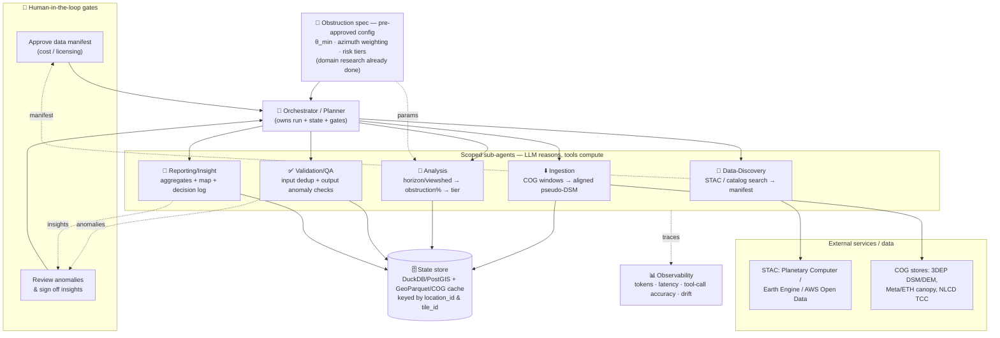

# Architecture — Agent-Driven Pipeline

The orchestration layer. Six agent roles, the tools they may call, how state and results flow, where humans intervene, what happens when things break, and how it stays affordable at 1M locations.

> Governing principles (see [README](../README.md)): **(1)** LLMs orchestrate and reason; deterministic geospatial code computes. **(2)** LLM cost is O(tiles/agents/run), never O(locations).

> **What this repo implements.** The code ships a 4-agent proof-of-concept — **`data-discovery`** (A1; live STAC catalog + web search → ranked data manifest), **`ingestion`** (A2; live per-tile COG fetch + align → aligned pseudo-DSM), `geo-analysis` (A3; per-location obstruction sampling + risk scoring), and `qa` (A4; output anomaly checks) — defined in [`src/leo_pipeline/agents`](../src/leo_pipeline/agents/__init__.py). Input profiling + coordinate de-dup and UTM tiling are deterministic pre-steps ([`ingest.py`](../src/leo_pipeline/ingest.py) / [`tiling.py`](../src/leo_pipeline/tiling.py)), not an agent. **A1 is live:** `get_aoi_bbox`, `stac_search` (pystac-client over Microsoft Planetary Computer), and `write_data_manifest` return real results and persist the manifest the H1 gate reviews; driven on its own via `python -m leo_pipeline.run_discovery` (with an optional `--bbox` AOI override, against which `get_aoi_bbox` counts the locations actually inside the box). **A2 is live:** `stac_item_read` (resolve an approved collection to a signed, download-ready COG for a tile), `fetch_aligned_surface` (windowed rasterio read → reproject to the tile's auto-UTM zone → fuse `DEM + max(canopy, building)` into a pseudo-DSM, or pass a true lidar DSM through; tile-keyed, content-addressed, idempotent cache), and `cache_rw` ([`src/leo_pipeline/tools`](../src/leo_pipeline/tools/__init__.py)); driven on its own via `python -m leo_pipeline.run_ingestion`. Both are covered by an offline `tests/` suite (plus opt-in live tests). Two **deferred gaps** in A2's live core: building-footprint rasterization (the pseudo-DSM currently fuses DEM + canopy only) and a full `cover_proxy` (DEM-only, low-confidence for now). That POC covers the **core** of the six-role design below; the remaining role (reporting A5) and the horizon toolset are the target architecture this document specifies, not yet wired into `src/`.

---

## 1. System diagram



> Also maintained as a standalone file: [`diagrams/architecture.mmd`](diagrams/architecture.mmd).

---

## 2. Agent boundaries & tool access

Each agent is a separate `AgentDefinition` (Claude Agent SDK) with an isolated context and a **least-privilege tool set**. The "search/download" agents the challenge asks about are **A1 (discovery)** and **A2 (ingestion)**.

The obstruction spec is **not** generated at runtime — the domain research is already complete, so θ_min, azimuth weighting, and the risk-tier thresholds enter the run as a **pre-approved, version-stamped config** (the `SPEC` node above; rationale in [rationale](rationale.md)). This drops a runtime agent and a human gate while keeping every score traceable to one spec version.

| Agent | Single job | Tools it may call | LLM does | Code does |
|---|---|---|---|---|
| **Orchestrator** | Run lifecycle, state, human gates, retries | `spawn_subagent`, `read/write_state`, `log` | Plan, route, decide gates | Persist state |
| **A1 Data-Discovery** | AOI + spec → ranked **data manifest** | `stac_search`, `http_get`, `web_search` | Rank by res / vintage / coverage / license | Catalog queries |
| **A2 Ingestion** | Per-tile fetch + align → **pseudo-DSM** | `stac_item_read`, `fetch_aligned_surface`, `cache_rw` | Pick fallback on failure | Windowed COG read, reproject, fuse |
| **A3 Analysis** | Score obstruction + classify tier | `compute_sky_obstruction`, `find_clear_sky_spot` | Choose params, handle edges | Horizon/viewshed math (vectorized) |
| **A4 Validation/QA** | Input quality + output anomalies | `qa_location_batch`, `sql_query`, `web_fetch` | Triage / explain anomalies | Dedup, stats, anomaly rules |
| **A5 Reporting** | Aggregates, map, plain-English log | `sql_query`, `render_map`, `write_file` | Write officer-facing narrative | Aggregations, map tiles |

**Why this split:** each boundary is drawn where the *tool access* and *failure mode* change. Discovery can touch the open internet but writes no data; ingestion writes data but never reasons about risk; analysis does math but never fetches; QA can read everything but only the orchestrator mutates run state.

---

## 3. Representative tool schemas

The challenge asks for explicit tool schemas. Here are the four load-bearing ones (the geo-engine tools are the real signal); the rest follow the same pattern.

```jsonc
// A1 — discovery
{ "name": "stac_search",
  "description": "Search a STAC catalog for raster assets covering an AOI.",
  "input_schema": { "type":"object",
    "properties": {
      "catalog_url": {"type":"string"},
      "collections": {"type":"array","items":{"type":"string"}},   // e.g. ["3dep-lidar-dsm","nlcd-tcc"]
      "bbox": {"type":"array","items":{"type":"number"},"minItems":4,"maxItems":4},
      "datetime": {"type":"string"},                                // ISO interval; vintage filter
      "max_items": {"type":"integer","default":50} },
    "required":["catalog_url","bbox"] },
  "returns": "array<{id, collection, asset_href, crs, gsd_m, datetime, coverage_pct}>" }
// shipped variant (src/leo_pipeline/tools): `catalog` accepts a configured key or a URL,
// and results are grouped per collection with an AOI-coverage probe + a capped item sample.

// A2 — ingestion (deterministic; the LLM only chooses fallbacks)
{ "name": "fetch_aligned_surface",
  "description": "Read COG windows for a tile, reproject to a metric CRS, fuse DEM + canopy/building height into a pseudo-DSM (or pass through a true DSM). Cached & idempotent.",
  "input_schema": { "type":"object",
    "properties": {
      "tile_id": {"type":"string"},
      "bbox": {"type":"array","items":{"type":"number"}},
      "manifest": {"type":"object","description":"dataset→asset_href map from A1"},
      "target_crs": {"type":"string","default":"auto-UTM"},
      "target_gsd_m": {"type":"number","default":10},
      "surface_mode": {"type":"string","enum":["true_dsm","pseudo_dsm","cover_proxy"]} },
    "required":["tile_id","bbox","manifest"] },
  "returns": "{dsm_uri, dem_uri, crs, gsd_m, vintage_map, coverage_flag}" }
// shipped & live (src/leo_pipeline/tools): windowed rasterio read + reproject (auto-UTM) +
// numpy fuse, writing a tile-keyed content-addressed GeoTIFF cache; returns also `confidence`
// + `valid_fraction`. On a layer read failure it returns a structured error naming the next
// surface_mode down the hierarchy, so the LLM's only call is which fallback to retry. A
// companion `stac_item_read` resolves an A1 collection to a signed COG href per tile, and
// `cache_rw` lets the agent skip already-built tiles. Deferred: building-footprint fusion
// (pseudo-DSM = DEM + canopy for now) and a full cover_proxy (DEM-only, low confidence).

// A3 — the analytical core (scenario 2: "does this location have enough visibility?")
{ "name": "compute_sky_obstruction",
  "description": "Per-azimuth horizon profile vs the required sky region; returns the solid-angle-weighted obstruction fraction the Starlink app would report.",
  "input_schema": { "type":"object",
    "properties": {
      "points": {"type":"array","items":{"type":"object",
        "properties":{"location_id":{"type":"string"},"lat":{"type":"number"},"lon":{"type":"number"}}}},
      "dsm_uri": {"type":"string"},
      "dish_height_m": {"type":"number","default":2.0},
      "sky_spec": {"type":"object",
        "properties":{"min_elev_deg":{"type":"number","default":25},
                      "az_center_deg":{"type":"number","default":0},      // 0 = north (NH)
                      "az_halfwidth_deg":{"type":"number","default":180},  // 180 = omni (conservative)
                      "az_weighting":{"type":"string","enum":["uniform","north_biased","tle_derived"]}},
        "required":["min_elev_deg"]},
      "azimuth_step_deg": {"type":"number","default":1},
      "max_radius_m": {"type":"number","default":2000},
      "earth_curvature": {"type":"boolean","default":true} },
    "required":["points","dsm_uri","sky_spec"] },
  "returns": "array<{location_id, obstruction_pct, blocked_azimuths, horizon_profile, risk_tier, confidence}>" }

// A3 — scenario 3 ("find a clearer spot within X m / how high to mount")
{ "name": "find_clear_sky_spot",
  "description": "Within an X-m buffer of a point, find candidate locations/heights with lower obstruction.",
  "input_schema": { "type":"object",
    "properties": {
      "lat":{"type":"number"},"lon":{"type":"number"},
      "buffer_m":{"type":"number","default":50},
      "dsm_uri":{"type":"string"},"sky_spec":{"type":"object"},
      "candidate_grid_m":{"type":"number","default":5},
      "dish_height_candidates_m":{"type":"array","items":{"type":"number"},"default":[2,4,8]} },  // models "go higher"
    "required":["lat","lon","dsm_uri","sky_spec"] },
  "returns": "array<{lat, lon, dish_height_m, obstruction_pct, improvement_pct}>" }
```

---

## 4. State management

Context cannot carry 1M rows, so a **single external source of truth** holds all state; agents pass **references**, not payloads.

- **Store:** `DuckDB` + `GeoParquet` (single-node) or `PostGIS` (scale). One row per `location_id`:
  `coords, tile_id, status, obstruction_pct, risk_tier, confidence, model_version, dataset_vintages, timestamps`.
  `status ∈ {pending, ingested, scored, failed, quarantined}`.
- **What flows through context:** tile IDs, bboxes, file URIs, the data manifest, batch summaries — never rasters or million-row payloads. This matches the Claude Agent SDK subagent model: a subagent does heavy work in isolation and returns only a compact final message.
- **Idempotency:** tile-keyed, content-addressed cache. Re-running a tile with unchanged inputs is a no-op → enables **resume**, **cost control**, and the **quarterly drift rerun**.
- **Versioning:** every row stamps `model_version` + `dataset_vintages`, so any score is reproducible and drift is detectable.

---

## 5. Failure handling

| Failure | Response |
|---|---|
| Bad input row (null island, off-CONUS, swapped lat/lon) | Route to **quarantine table** (dead-letter); never fail the batch. |
| Download / read error | Retry w/ backoff → **fall back down the data hierarchy** (true DSM → DEM+canopy-height → cover proxy) → mark tile `degraded`, lower `confidence`. |
| Anomalous output (e.g., a county at 100 % at-risk) | Threshold rule → LLM triage → **human review queue**. Never silently publish. |
| Tile-edge object (tall tree just outside the tile) | Ingest with a **buffer/overlap** ≥ max terrain radius so edge obstructions aren't lost. |
| Cost runaway | Per-run **token/$ circuit-breaker**; "LLM-per-location" is architecturally forbidden. |

Every location carries a **confidence + version stamp**, so partial/degraded results remain usable and auditable rather than silently wrong.

---

## 6. Scale strategy — keeping LLM cost O(tiles), compute O(locations)

A **cheap screen → expensive precise pass** funnel:

1. **Screen (≈ all 1M):** omnidirectional canopy-cover proxy, computed server-side in Earth Engine (point-sample NLCD TCC / canopy height). Cheap, fast, no per-point LLM.
2. **Flag:** keep the plausibly-at-risk subset.
3. **Precise pass (subset only):** full directional DSM-horizon (`compute_sky_obstruction`) on flagged tiles.
4. **LLM** is invoked per *tile batch / decision / anomaly*, not per location.

This is also the **"what breaks at 100×"** answer: nothing in the hot path is LLM-bound or O(locations) in network calls; you scale by adding tile workers.

---

## 7. Where humans intervene (2 gates)

The obstruction spec & risk thresholds (θ_min / azimuth / tier choices) are judgment calls, but they were signed off **offline** during the already-completed domain research and now enter the run as a version-stamped config — so they are no longer a *runtime* gate. Two gates remain:

- **H1 — Approve the data manifest** (after A1): cost and **licensing** (e.g., CostQuest Fabric, Maxar-derived heights) need a human decision before bulk download.
- **H2 — Review anomalies & sign off insights** (A4 → A5): anomalous regions and the final officer-facing numbers get human eyes before publication.

---

## 8. Key design decisions (decision log)

| Decision | Alternatives weighed | Reasoning | Would revisit if… |
|---|---|---|---|
| LLM orchestrates; deterministic code scores | LLM scores each location | Reproducibility + cost; geospatial math must be auditable | Per-location *qualitative* judgment ever became the goal |
| **Obstruction spec as a pre-approved config** (no runtime research agent) | A Domain-Research agent that re-reads the guide/specs every run | Research is a one-time, human-reviewed task; freezing it into a version-stamped config removes a runtime LLM dependency **and** a human gate, and ties every score to one spec version | The spec had to be re-derived per run — new provider/dish generation, or AK/HI high-latitude θ_min |
| Per-azimuth **horizon profile** (`r.horizon`) | Binary `gdal_viewshed` | We compare to an elevation *threshold* + sky *distribution*, not just visible/not | A pure binary "any obstruction" answer sufficed |
| **Pseudo-DSM** fusion w/ fallback hierarchy | Cover-% proxy only; or true-DSM only | Best accuracy where lidar exists, graceful degradation elsewhere | National 1 m DSM coverage became universal |
| **Two-pass** screen→precise | Single precise pass over all 1M | Cuts the expensive compute to the subset that matters | Compute became free/instant |
| **Directional** (north-biased) sky region | Omnidirectional buffer | Avoids the ~50 %-of-edge-cases error from ignoring dish azimuth | Validation showed omni was good enough |
| **Claude Agent SDK** subagents | LangGraph / CrewAI / single agent | Matches provided tooling; isolated context + scoped tools fit the role split | Team standardized on another framework |

---

## 9. (Bonus) Observability & drift

- **Per-agent:** task success rate, latency, token usage / est. cost at scale.
- **Tool-call quality:** did the agent call the right tool with valid args? (schema-validation pass rate, retry count).
- **Output quality:** % of locations scored (vs quarantined/degraded), anomaly-flag rate, agreement with the Starlink-app calibration sample.
- **Drift (next-quarter rerun):** pin dataset versions; monitor (a) input distribution (new/moved Fabric IDs), (b) score distribution per state/county vs last run, (c) dataset-vintage changes. Alert on distribution shift, not just errors.
- **Tooling:** Langfuse / Phoenix / OpenTelemetry for traces + cost.
