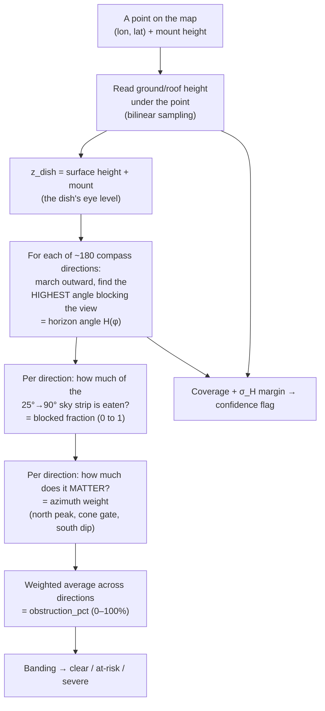

# Analysis rationale

> Status: complete.

## From install-guide requirements to methodology

From the PDF, we know that Starlink must be installed on the roof of a building and meet the following requirement:

No nearby tree or building rises above the dish's minimum reception line. For a single obstacle, the clear-view (installable) condition is:

$$ H_b - H_a < \text{Dist}_{ab} \tan \theta $$

where $a$ is the current building (where the dish sits) and $b$ is a nearby obstacle, $H$ is the height of the top of the building or obstacle (relative to a common datum), $\text{Dist}_{ab}$ is the horizontal ground distance between them, and $\theta$ is the **minimum reception (elevation) angle measured from the horizontal**.

**Derivation.** The elevation angle from the dish up to the top of the obstacle is
$\alpha = \arctan\!\big((H_b - H_a) / \text{Dist}_{ab}\big)$. The obstacle blocks the view only when it
rises above the minimum reception line, i.e. $\alpha > \theta$. Rearranging the clear-view case
$\alpha < \theta$ gives the inequality above. It degrades sensibly: if $H_b < H_a$ the left side is
negative and the condition always holds (a shorter obstacle never obstructs).

**Scope of the formula.** This is the per-obstacle, single-direction kernel — *not* a full
clear-view test on its own. Starlink needs an unobstructed cone across a range of azimuths
(and a specific sky region by latitude), so the methodology applies this inequality to *every*
candidate obstacle within the dish's relevant azimuth/distance window; a location is clear only
if the condition holds for all of them. This is what motivates a viewshed/horizon-style analysis
over a simple buffer (see "Why this approach" below).

**Assumptions and simplifications** (expanded under "Known limitations"):
- $\theta$ is referenced to the horizon (Starlink's published minimum elevation, ~25°). If it were
  measured from zenith, the relation would invert to $\cot\theta$.
- Heights are taken from a common datum, so terrain, canopy, and building heights must be referenced
  consistently (e.g. all DEM-relative). Because $H_b$ and $H_a$ are each datum-referenced (ground
  elevation + object/mount height), **terrain slope between the dish and the obstacle is captured
  automatically**: an uphill obstacle breaches the reception line at a lower physical height than a
  downhill one, with no separate slope term needed.
- $H_a$ should ideally include the dish mount height above the roof, not the roof alone. In a bulk/remote
  assessment the mount height is usually *unknown* — handled via the vertical-uncertainty budget below.
- Earth curvature is ignored — negligible at the few-hundred-metre obstacle distances here (sub-centimetre
  drop). It would matter only for kilometre-scale terrain masking, which is out of scope for this kernel.


| Install-guide requirement | Obstruction factor | Modeled with | Tool |
|---------------------------|--------------------|--------------|------|
| _e.g. clear view of sky_  | tree canopy        | canopy-height raster | `fetch_aligned_surface` → `compute_sky_obstruction` |
| _e.g. unobstructed cone_  | terrain blocking   | DEM (fused surface horizon) | `fetch_aligned_surface` → `compute_sky_obstruction` |
| _e.g. no nearby structures_ | buildings (lidar-DSM only; footprint fusion deferred) | building footprints | `fetch_aligned_surface` → `compute_sky_obstruction` |

> **Tool note (as implemented).** The three obstruction factors are fused into one surface
> by the A2 `fetch_aligned_surface` tool (a gap-filled DEM/lidar mosaic, §"Best-available-per-pixel
> mosaic" below) and scored by the A3 `compute_sky_obstruction` tool via the horizon profile.
> The earlier `lookup_obstruction_layer` / `compute_risk_score` placeholder stubs named in the
> first design pass were **replaced** by these two real tools, and there is no separate weighted
> "risk score" step — the single `obstruction_pct` is the score. Building *footprints* are a
> deferred input: structures enter the surface only where a lidar DSM already captures them
> (see "Buildings" under Known limitations).

## Starlink reception geometry (parameter defaults)

The kernel above needs two physical inputs from the Starlink system: the **minimum reception
(elevation) angle** $\theta$ and the **azimuth window** over which the dish must see clear sky.
Both are hardware/regulatory parameters, not constants we should bury in code — we expose them and
adopt conservative defaults.

### Minimum reception angle $\theta$

Whether an obstacle matters is an *angular* test, not a fixed distance: it obstructs only if its
elevation from the dish exceeds $\theta$ (the $\alpha > \theta$ condition above).

- **Default: $\theta = 25°$** above the horizon. This is the classic FCC-licensed minimum below
  which satellites were not used, and the value baked into Starlink's own obstruction-check tool —
  so it is the conservative, well-documented choice.
- **Recently relaxed (FCC approval, Apr 2026):** down to **10°** for satellites below 400 km,
  **20°** for 400–500 km, and as low as **5°** at high latitudes (>62°N). A *lower* $\theta$ means
  each satellite is usable longer but the ground exclusion zone grows — so this is a knob, not a
  free win. We keep $\theta$ a parameter and can re-score at 10–20° to reflect the new rules.

Because $d_{max} = (H_{b,max} - H_a)/\tan\theta$ (see search-window assumption below), the choice of
$\theta$ directly sets how far out an obstacle of given excess height $\Delta H = H_b - H_a$ can still
breach the reception line. The maximum blocking distance is $\Delta H / \tan\theta$:

| $\theta$ | $1/\tan\theta$ (distance factor) | Blocking range for $\Delta H = 10$ m |
|----------|----------------------------------|--------------------------------------|
| **25°** (default) | ≈ 2.1× | ~21 m |
| 20°      | ≈ 2.7× | ~27 m |
| **10°** (new low) | ≈ 5.7× | ~57 m |

The 25° factor (≈ 2.1 m of clear horizontal distance per 1 m of obstacle height above the dish)
matches the common field rule of thumb of "2–3 m per metre of height" — it is simply $1/\tan 25°$.

### Reception cone (azimuth/FOV window)

Starlink's phased-array antenna scans a *cone* of sky and reports obstructions as a **percentage of
that cone blocked**, not a binary clear/blocked. That percentage should be weighted by **satellite
dwell-time across the sky**, not by raw solid angle: a patch the constellation transits often (mid/high
elevations toward the assigned pointing direction) costs far more when blocked than an equal-area patch
the dish rarely uses. The impact metric is therefore *fraction of usable sky-**time** removed*, which
makes obstruction a graded penalty rather than a binary flag. The full cone angle is hardware-dependent:

| Dish | Field of view (full cone) | Half-angle from boresight |
|------|---------------------------|---------------------------|
| Gen2 standard (round/rectangular) | ~100° | ~50° |
| Gen3 standard | ~110° | ~55° |
| Flat High Performance | ~140° | ~70° |

Two consequences for the methodology:
- **The cone is tilted, not zenith-centred.** The dish aims its boresight toward the constellation
  region it is assigned to; in the continental US that is generally **north**, and elsewhere it is
  location-specific (the Starlink app reports the optimal direction). The obstruction-relevant azimuth
  arc is therefore centred on that pointing direction, not a full 360°. This is what justifies an
  azimuth-gated viewshed over a plain radial buffer (see "Why this approach").
- **Why north — and how much the south is *really* excluded.** Two distinct mechanisms bias CONUS usage
  northward, and conflating them overstates the exclusion:
  1. *Orbital geometry.* The main shells are inclined ~53°, so for any CONUS latitude (<53°N) the
     time-integrated satellite density is higher toward the **poleward (northern)** sky.
  2. *Regulation (EPFD / GSO-arc avoidance).* Terminals must not transmit to satellites within ~18° of
     the **geostationary arc**, which for a CONUS observer sits across the **southern** sky at moderate
     elevation — carving a regulatory keep-out *band* around that arc, not the whole hemisphere.

  The correct read is therefore **not** "the southern sky is unusable." It is: the **mid/low-elevation
  southern band around the GSO arc is de-weighted/excluded**, while **higher-elevation southern passes
  outside that band remain usable**. So a tall, close obstacle due south can still remove usable sky and
  is not safe to ignore — the azimuth weighting is a *gradient* (heaviest in the north, lightest in the
  GSO-arc band), not a hard north-only mask.
- **Default cone width: 110° (Gen3 standard);** 140° for High Performance hardware. We treat this,
  like $\theta$, as a parameter so a site can be re-evaluated for a wider-FOV dish.

### Risk banding context

Field guidance: obstructions blocking **1–5%** of the cone are typically tolerable for normal use;
**~10%+** begins causing meaningful dropouts. This informs the `at-risk` band thresholds rather than
a binary verdict (see "Definition of at-risk").

### Vertical uncertainty — why the output is banded, not sharp

The kernel $H_b - H_a < \text{Dist}_{ab}\tan\theta$ is exact geometry, but its inputs are not; treating it
as a crisp threshold would manufacture false precision:

- **Surface heights carry multi-metre error.** Canopy-height models, DSMs and building layers typically
  have vertical RMSE of a few metres, and may be several epochs stale (trees grow, structures appear).
- **Dish height $H_a$ is usually unknown** for a bulk/remote assessment — we know a roof exists, not the
  mount height above it. We default to roof-only and sweep one or two mast heights, but the residual is real.
- **Horizontal position/distance** also carry error, which propagates through $\tan\theta$.

We therefore carry a **vertical-uncertainty budget $\sigma_H$** (a parameter) and report a **banded**
result rather than a single clear/blocked verdict, with $\sigma_H$ flowing into the confidence flag.

**As implemented vs. the principled target.** Two clarifications where the current build is narrower than
the ideal above:
- **The risk *tier* is a pure function of `obstruction_pct`** against the band cut-points (`classify_tier`
  in [`horizon.py`](../src/leo_pipeline/horizon.py)); $\sigma_H$ does **not** currently move a point between
  `clear` and `at-risk`. Instead, $\sigma_H$ feeds the **confidence flag**: when the controlling surface
  sits within $\pm\sigma_H$ of the $\theta$-line (the clearance $m = (H_b - H_a) - \text{Dist}_{ab}\tan\theta$
  could flip under the data error), the verdict is reported **one confidence notch lower**, not re-tiered.
  A full probabilistic clearance-margin model that shifts the tier itself is a documented next step.
- $\sigma_H$ is a **single global default (3.0 m)** in `config.Analysis`, not yet a per-layer value derived
  from each source's stated RMSE — per-layer $\sigma_H$ is the intended refinement.

A case where $H_a$ cannot be established at all — i.e. no elevation datum sits under the point, not even the
globally complete DEM — is `undetermined`. This is the link between the geometry and the three-state output
defined under "Assumptions."

### Recommended defaults (summary)

- **Min elevation $\theta$:** 25° (conservative default); parameterised and **dated** — re-scorable at
  10–20° (5° above 62°N) per the 2026 rules, and expected to keep falling as low-altitude shells come
  online. Store it with an "as-of" date: a *lower* $\theta$ *widens* the cone and *grows* the search
  radius, so it is a knob, not a free win.
- **Cone half-angle:** 55° (Gen3 standard, 110° full); 70° for High Performance.
- **Azimuth weighting:** a *gradient* centred on the dish pointing direction (north-ish in CONUS),
  heaviest at mid/high northern elevations and lightest in the southern GSO-arc keep-out band — not a
  hard north-only mask, and not a full 360°.
- **Impact metric:** **% of usable sky removed**, banded into `clear` / `at-risk` thresholds (≈1–5%
  tolerable, ≈10%+ disruptive) — never a bare binary. *As implemented the weighting is **azimuthal***
  (a per-bearing dwell gradient); within the cone, elevations $[\theta, 90°]$ are weighted uniformly.
  Full elevation-resolved sky-**time** weighting is the v2 TLE map (see "The more principled version").
- **Vertical-uncertainty budget $\sigma_H$:** a single global default (3.0 m; per-layer is the intended
  refinement), folded into the **confidence flag** so borderline cases drop a confidence notch — it does
  not currently re-tier a point from `clear` to `at-risk`.
- **Per-feature screening radius:** the *per-feature* cutoff is exact — a sample beyond
  $\Delta H / \tan\theta$ cannot breach the $\theta$-line, so it never sets the horizon (geometry, not a
  heuristic). The *outer query bound*, however, is **as-implemented a single fixed clamp**
  `max_radius_m = 1500 m` for all classes, not the per-class derived radius described below; the
  `derived_max_radius()` helper exists but is not yet wired into the scoring path (see the per-class table).

**Sources:**
[DishyTech – obstructions & field of view](https://www.dishytech.com/starlink-obstructions-how-much-is-too-much/),
[DishyTech – dish pointing direction](https://www.dishytech.com/starlink-dish-placement-which-way-should-it-face/),
[InstallersPH – Gen3 specs (FOV)](https://installersph.com/starlink-performance-gen-3-specs-overview/),
[Space Internet Solutions – 25°→10° elevation change](https://www.spaceinternetsolutions.com/post/starlink-lowers-angle-to-10-degrees),
[Gear Musk – FCC elevation approval (Apr 2026)](https://gearmusk.com/2026/04/16/fcc-approval-starlink-dish/),
[5gstore – Starlink wider view / lower min-elevation (Apr 2026)](https://5gstore.com/blog/2026/04/21/starlink-dishes-wider-view-fcc-approval/),
[FCC – EPFD limits & GSO-arc avoidance framework (FCC-26-26)](https://docs.fcc.gov/public/attachments/FCC-26-26A1.pdf),
[Starlink Help Center – fixing obstructions](https://starlink.com/support/article/64009737-3768-0003-2838-4786c5a850ea).

## Mathematical design — the obstruction engine, step by step

This section is the plain-language tour of the math inside
[`horizon.py`](../src/leo_pipeline/horizon.py) — the deterministic core the architecture keeps
**out** of the LLM (*"LLM reasons, tools compute"*). You do **not** need a maths background:
every formula below comes with an everyday analogy and a picture. The one idea to hold onto is
this — **we never ask "is the sky blocked, yes or no?" We measure, direction by direction, how
much of the useful sky a dish would lose, then blend those directions into a single percentage.**

A few words you will see throughout:

- **Azimuth** = a compass bearing. North = 0°, East = 90°, South = 180°, West = 270°.
- **Elevation angle** = how high you tilt your head to look at something. 0° = the flat horizon,
  90° = straight up.
- **Boresight** = the direction the dish *aims* (north-ish in the US).
- **DSM** ("surface model") = a height map of the ground **including** trees and buildings — so a
  rooftop or a tree-top has its real height, not the bare earth beneath it.
- $\theta$ (theta) = the **minimum elevation** the dish needs clear (default **25°**). Anything
  below 25° doesn't count as usable sky in the first place.
- $z_{dish}$ = the height of the dish itself (ground height under it **plus** the mount height).

### The whole pipeline in one picture



Each box is a real function in `horizon.py`; the rest of this section opens them one at a time,
in the order the code runs them.

### 1. Walking outward along each compass bearing

To find what blocks the view in a given direction, the code "walks" from the dish outward along
that bearing in small steps (every few metres, out to `max_radius_m`), checking the ground height
at each step (`horizon_profile`, horizon.py:215–218).

Turning a compass bearing $\varphi$ and a distance $r$ into an actual map position uses basic
trigonometry (north = 0°, going clockwise):

$$x = x_0 + r\,\sin\varphi, \qquad y = y_0 + r\,\cos\varphi$$

*Analogy:* stand at the dish, face one of ~180 directions, and take steps outward, glancing at
the height of the ground every few metres. Do that for every direction and you've "felt out" the
entire skyline around the point.

```
            N (0°)
              |
   NW         |         NE
        \     |     /
         \    |    /          a "ray" marched outward
W(270°)---- DISH ----•---•---•---•→  E (90°)
         /    |    \         r = 5m,10m,15m … out to max_radius
        /     |     \
   SW         |         SE
              |
            S (180°)
```

### 2. Reading the height *between* grid pixels (bilinear sampling)

The height map is a grid, but our marching steps rarely land exactly on a grid pixel. So we blend
the **four surrounding pixels**, weighting each by how close it is — this is *bilinear sampling*
(`SurfaceSampler.sample`, horizon.py:105–140).

*Analogy:* if you're standing ¾ of the way from one fence-post to the next, your ground height is
mostly the far post's height and a little of the near post's — a smooth ramp, not a sudden step.

```
   pixel (r0,c0) ───────── pixel (r0,c1)
        │      (1-tc)·(1-tr) │ tc·(1-tr)
        │            • ←── your sample lands here
        │  (tc, tr) = fractional position inside the cell
        │      (1-tc)·tr     │  tc·tr
   pixel (r1,c0) ───────── pixel (r1,c1)
```

The closer corner gets the bigger share. One important safety rule: if a pixel is **missing data**
(a gap in the surface), it is dropped from the blend — the code never invents a fake height. Gaps
instead lower the **confidence** of the answer (see §9), which is the honest thing to do.

### 3. The heart of it — the horizon angle $H(\varphi)$

For one bearing, every step outward gives a height. Compare each to the dish's eye level
$z_{dish}$: something taller than the dish blocks the view, and **how high you must look to clear
it** is an angle. The horizon for that bearing is simply the **largest** such angle along the ray
(`horizon_profile`, horizon.py:220–228):

$$H(\varphi) = \max_{r}\ \arctan\!\left(\frac{Z_{\text{surface}}(\varphi, r) - z_{dish}}{r}\right)$$

*Analogy:* looking along one direction, the **tallest thing relative to your eye** is what sets
how high you must tilt your head to see open sky past it. A nearby tall building and a far-away
taller hill can give the same angle — that's why the formula divides height-difference by distance
$r$ (rise over run).

```
        sky
         ·  ·  ·  ←── open sky starts here
        /
       /  ← you must look up to angle H to clear the obstacle
      /│
     / │  ▓▓  building, height above dish = Z_surface − z_dish
DISH•──┴──▓▓──────────  ground
    └─ r ─┘
    H = arctan( (Z_surface − z_dish) / r )
```

A pixel with missing data is forced to an angle of **−90°** so it can never accidentally become
"the tallest thing" and raise the horizon — gaps lower confidence, they don't fake an obstacle.

### 4. The optional curved-Earth correction

Over long distances the Earth's curvature makes far-off ground sit a little **lower** than a
perfectly flat sightline would suggest; light bending in the atmosphere (refraction) cancels about
13% of that. When `earth_curvature` is on, the height difference is nudged down by a small amount
that grows with distance (horizon.py:222–224):

$$\Delta z \;\rightarrow\; \Delta z \;-\; (1 - k)\,\frac{r^{2}}{2R}, \qquad k = 0.13,\ \ R = 6{,}371{,}000\text{ m}$$

*Analogy:* a ship's hull disappears over the sea horizon before its mast does — distant things
dip below your flat line of sight. This correction is **off by default** and only matters at long
range (the $r^2$ term is tiny up close), so it rarely changes a near-field verdict.

### 5. How much of one direction's sky is blocked

A dish only cares about sky **above $\theta$** (default 25°) up to straight-up (90°). For each
bearing we ask: of that vertical strip from 25° to 90°, what fraction does the horizon eat from
the bottom? (`obstruction_fraction`, horizon.py:286–288):

$$\text{blocked}(\varphi) = \frac{\operatorname{clip}\big(\min(H, 90) - \theta,\ 0,\ 90-\theta\big)}{90 - \theta}\ \in [0, 1]$$

*Analogy:* picture a column of useful sky 65° tall (from 25° up to 90°). If the horizon in that
direction is at 40°, it has eaten the bottom 15° — that's $15/65 \approx 0.23$, so **23% of that
direction's sky is gone.** A horizon at or below 25° eats nothing (0); a horizon at 90° eats
everything (1).

```
   90° ┄┄┄ top of useful sky ┄┄┄┄┄┄
       │                          │
       │      OPEN  (counts)      │  ← 40° to 90° is clear
   40° ┝━━━ horizon H here ━━━━━━━┥
       │▓▓▓▓ BLOCKED (eaten) ▓▓▓▓▓│  ← 25° to 40° is lost
   25° ┕━━━ θ = min elevation ━━━━┙   blocked = (40−25)/65 ≈ 0.23
       (below 25° doesn't count at all)
```

### 6. How much each direction *matters* — the azimuth weight

Not all directions are equal. Satellites spend more time in some parts of the sky, so a blockage
there costs more usable connection time. The weight per bearing (`azimuth_weights`,
horizon.py:257–275) combines **three** ideas, applied to the offset
$\Delta = \varphi - \text{boresight}$ (wrapped to the range −180°…180°):

1. **Cone gate.** The dish only sees a cone. Outside the half-width (default 55° each side of
   boresight) the weight is **0** — those directions are ignored entirely.
2. **A smooth north peak (raised cosine).** Inside the cone the weight is highest at the aim
   direction and tapers gently to the edges:
   $$w = \tfrac{1}{2}\,\big(1 + \cos\Delta\big)$$
   This is **1.0** dead-centre and about **0.79** at the 55° edge — a gentle gradient, not an
   on/off mask (consistent with "the azimuth weighting is a *gradient*" above).
3. **Southern keep-out dip.** Within 18° of due-south (the regulatory GSO-arc band) the weight is
   multiplied by **0.15** — dimmed, not killed, because high passes there can still be usable.

*Analogy:* it's like grading where the front-row seats (the aim direction) count most, the
side seats count a bit less, seats outside the room don't count at all, and a few seats behind a
pillar (the southern band) barely count.

```
 weight
 1.0 |              ●  ← boresight (north), w = 1.0
     |          ●       ●
 0.8 |      ●               ●  ← cone edge (55°), w ≈ 0.79
     |   ●                     ●
 0.0 |●──┴────┴────┴────┴────┴──●═══════════ (outside cone → 0)
     -55°    -27°   0°   +27°  +55°  …  180°(south, dipped ×0.15)
              azimuth offset from the aim direction
```

(`uniform` weighting skips steps 2–3 — flat 1.0 inside the cone. `tle_derived` is a planned v2
that currently falls back to this north-biased shape.)

### 7. Blending it all into one percentage

Now combine the two per-direction numbers — **how blocked** (§5) and **how much it matters**
(§6) — into a single score. It's a **weighted average**, divided by the total weight so the
result is always a clean 0–100% (`obstruction_fraction`, horizon.py:289–291):

$$\text{obstruction\_pct} = 100 \times \frac{\sum_\varphi w(\varphi)\,\text{blocked}(\varphi)}{\sum_\varphi w(\varphi)}$$

*Analogy:* exactly like a grade-weighted class average. Directions that matter more pull the
score harder; dividing by the total weight means the answer doesn't change just because we used
more directions or a wider cone — it stays an honest "share of useful sky lost."

**A worked example** (three directions inside the cone, numbers verified against the code):

| Bearing $\varphi$ | Horizon $H$ | blocked = $(H-25)/65$ | weight $w$ | $w \times$ blocked |
|------|------|------|------|------|
| 0° (north, dead-centre) | 40° | 0.231 | 1.000 | 0.231 |
| 30° | 30° | 0.077 | 0.933 | 0.072 |
| 50° (near cone edge) | 0° | 0.000 | 0.821 | 0.000 |
| **totals** | | | **2.754** | **0.303** |

$$\text{obstruction\_pct} = 100 \times \frac{0.303}{2.754} \approx \mathbf{10.98\%}$$

The northern blockage dominates because it carries the most weight; the cleared edge direction
pulls the average down. **10.98%** lands in the **severe** band (next).

### 8. From a percentage to a verdict — the bands

The single percentage becomes a colour-coded tier (`classify_tier`, horizon.py:300–308), using
the field guidance above ("1–5% tolerable, ~10%+ disruptive"):

```
   0% ─────────────┬──────────────────────────┬──────────────► 100%
      🟢 clear      1%      🟡 at-risk         10%   🔴 severe
      (≤ 1%)              (1% – 10%)               (≥ 10%)
```

To keep the number and its colour consistent, the code **rounds the percentage once** and then
decides the tier on that same rounded value (horizon.py:438) — so a result can never display as
"1.0% 🟢 clear" while secretly having been tiered from 1.004%. A separate state, **undetermined**,
is used when there's no height data under the point at all (no ground to mount the dish on) — that
isn't a percentage at all, it's "we couldn't measure."

### 9. How sure are we? — the confidence flag

Every verdict ships with a **high / medium / low** confidence built from three physical signals
(`confidence_flag`, horizon.py:319–360), so a shaky reading is still usable but clearly labelled:

```
   start from the DATA SOURCE under the point:
        lidar ─────────────► high     (measured: trees + buildings)
        DEM+canopy / +bldg ─► medium  (modelled, not measured)
        bare-DEM fill ──────► low     (can't see trees/buildings at all)

   then knock DOWN a rung when the answer is shaky:
        ▼ −1 or −2  if the near-field sky is poorly sampled (gaps where it counts)
        ▼ −1        if the verdict is a coin-flip: the deciding surface sits within
                    ±σ_H (default 3 m) of the cut-off line — multi-metre data error
                    could flip it either way

   high ▲
   med  │   (each ▼ drops one rung; floor is low, ceiling is high)
   low  ▼
```

*Analogy:* you trust a reading more when it comes from a **good instrument** (lidar), when you got
**plenty of samples** where it matters, and when the result isn't **borderline**. Miss any of
those and the confidence steps down a rung — the number stays, the caveat is attached.

### 10. Two supporting formulas

**Clearance margin — "how close to the edge?"** (horizon.py:244–247). The cut-off line an obstacle
must reach to start blocking sits at height $z_{thr} = z_{dish} + r\tan\theta$ at distance $r$. The
gap between that line and the actual surface is the **margin** $m = z_{thr} - z_{\text{surface}}$.
A small margin (within $\pm\sigma_H$) is the "coin-flip" trigger in §9.

```
                          θ-line: z_dish + r·tanθ
   z_dish •┄┄┄┄┄┄┄┄┄┄┄┄┄┄┄┄┄┄┄┄┄┄┄┄┄
          │           ↕ margin m (room before it blocks)
          │        ▓▓▓ surface (roof/tree-top)
          └──────── r ─────────►
```

**Derived search radius — "how far do we even need to look?"** (`derived_max_radius`,
horizon.py:379–385). An obstacle of excess height $\Delta H$ above the dish can only breach the
$\theta$-line if it's closer than:

$$d_{\max} = \frac{H_{b,\max} - H_a}{\tan\theta} = \frac{\Delta H}{\tan\theta}$$

*Analogy:* a short obstacle far away simply can't poke above your 25° sightline — so there's no
point searching past $d_{\max}$. This is the same $1/\tan\theta$ "distance factor" as the table in
the reception-geometry section above (≈ 2.1 m of reach per metre of height at 25°).

### Reading the code — concept → function map

| Concept (section) | Function in `horizon.py` | Lines |
|---|---|---|
| March a bearing, build the profile (§1, §3, §4) | `horizon_profile` | 190–249 |
| Read height between pixels (§2) | `SurfaceSampler.sample` | 105–140 |
| Blocked fraction + blend to a % (§5, §7) | `obstruction_fraction` | 278–297 |
| Direction weights (§6) | `azimuth_weights` | 257–275 |
| Bands → tier (§8) | `classify_tier` | 300–308 |
| Confidence flag (§9) | `confidence_flag` | 319–360 |
| Clearance margin / search radius (§10) | `horizon_profile` / `derived_max_radius` | 244–247 / 379–385 |
| Full per-point score (ties it together) | `score_xy` | 394–464 |

## Assumptions & open questions

### Assumptions (defaults we adopt unless told otherwise)

- **Roof install on an existing building.** Following the PDF, the dish is mounted on the roof of
  the building at the requested location; $H_a$ is the roof height (ideally plus mount height).
- **Mount/pole height is a parameter, not a fixed value.** We evaluate at a roof-only default
  ($H_a$ mount height $= 0$ m above the surface) and sweep the **Starlink-shipped 0.3 / 0.6 m
  (1–2 ft) pole raises** (`mount_heights_m = (0.0, 0.3, 0.6)`), so the agent can report "clear if
  raised to 0.3/0.6 m" against hardware that actually ships — not an arbitrary tall mast.
- **Alternative-location suggestions are clipped to a buffer (a parcel-clip proxy).** The
  `find_clear_sky_spot` tool searches a grid of candidate positions/mast heights within an `buffer_m`
  radius (default **50 m**) of the flagged point and keeps only those inside that circle. *As
  implemented this is a buffer-radius proxy*, **not** a true parcel clip — no parcel layer is wired in,
  so the "constrained to the requester's own parcel / curtilage" goal is approximated by the buffer.
  Cross-parcel suggestions remain out of scope (they would need easement/permission data we do not model).
- **Three-state assessment, not binary.** Outcomes are `clear` / `at-risk` / `undetermined`. A location
  is only scored when we can establish the dish height; otherwise it is `undetermined` with a reason code.
- **"No building found" disambiguation is an *intended design*, not yet in the live build.** A missing
  footprint alone cannot distinguish (1) a genuinely vacant lot from (2) an unreliable/stale source; the
  design corroborates against an independent height surface (nDSM = DSM − DEM), a second footprint source,
  and coverage metadata. *As implemented this is deferred*: building footprints are not yet an input
  (structures enter the surface only via lidar DSM where present), so there is no footprint-vs-nDSM
  corroboration step. What the live build **does** carry instead is the per-pixel **provenance** confidence
  (lidar / DEM+canopy / bare-DEM fill) — a point scored on bare DEM is flagged low-confidence rather than
  asserted as fact. The dish is mounted on the *surface elevation* under the point (never a silent
  $H_a = 0$); a point with no surface datum at all is `undetermined`.
- **Input locations are in WGS84 and inside the service footprint.** The CSV `latitude`/`longitude`
  are EPSG:4326 degrees; we assume each point already lies within Starlink's LEO service footprint
  and assess *obstruction* risk only, not footprint membership or latitude-band eligibility.
  Horizontal distances ($\text{Dist}_{ab}$) are computed in a local metric CRS (or geodesically),
  and all heights share one vertical datum.
- **Bounded azimuth/distance search window.** Obstacles are only considered within the azimuth arc
  and out to a maximum horizontal distance relevant to the dish's view cone. The *per-sample* cutoff
  $d_{max} = (H_{b,max} - H_a)/\tan\theta$ — the range at which even a tallest-plausible obstacle can no
  longer breach the minimum reception line — is enforced exactly by the horizon geometry (a sample past it
  yields an angle below $\theta$). *As implemented*, the outer march itself is bounded by a single
  `max_radius_m = 1500 m` clamp rather than the per-class derived radius (see the per-class table), which
  bounds the per-point query without scanning all features.
- **Units are metres and degrees.** Heights and distances in metres, angles ($\theta$, $\alpha$) in
  degrees; rasters are resampled to a common resolution before sampling.
- **One dish per location; mast height swept, not multiplied.** We model a single dish per
  `location_id`. Multiple mount options are explored only through the mast-height parameter sweep
  (roof-only default plus standard masts), not as independent simultaneous installs.
- **Conservative, single-epoch surfaces.** We use the most recent available raster epoch and treat
  canopy as leaf-on (worst case), so `clear` verdicts are conservative; we do not model seasonal
  foliage change or future growth (tracked under "Known limitations").


## Why this approach (vs. alternatives)

The kernel above is a *per-obstacle, single-direction* angular test. Aggregating it over every
bearing around the dish is exactly a **per-azimuth horizon profile** $H(\varphi)$ — for each compass
bearing $\varphi$, the largest obstruction elevation angle produced by any feature in that direction:

$$ H(\varphi) = \max_{r}\ \arctan\!\Big( \frac{Z_{\text{surface}}(\varphi, r) - Z_{\text{dish}}}{r} \Big) $$

where $Z_{\text{surface}}(\varphi, r)$ is the fused-surface elevation at bearing $\varphi$ and ground
distance $r$, and $Z_{\text{dish}}$ is the dish-top elevation ($H_a$ in the kernel). A sky direction
$(\varphi, \theta)$ is blocked iff $\theta < H(\varphi)$, and `obstruction_pct` is the dwell-time-weighted
share of the required sky region that falls below its local horizon. Choosing this primitive — rather
than the obvious shortcuts — is the central modeling decision, so each rejected alternative is defended
explicitly below.

**vs. a simple radial buffer** ("any tall canopy within $X$ m → at-risk"). Two independent failures:

1. *It is omnidirectional, but the problem is not.* The dish sees a tilted cone centred on its pointing
   direction (north-ish in CONUS), with a graded de-weighting in the southern GSO-arc band (see the
   reception-geometry section). A buffer weights *every* bearing equally, when the cost of a blocked
   patch is strongly direction-dependent — heaviest in the north, lightest in the GSO keep-out band. It
   therefore mislabels a large share of the directional edge cases (dense stand to the south vs. to the
   north), which is the single most likely "debug this wrong answer" case in a live review.
2. *A fixed radius is physically wrong.* Blocking range scales as $\Delta H / \tan\theta$, so it depends
   jointly on each obstacle's excess height $\Delta H = H_b - H_a$ and on $\theta$: a 20 m tree matters
   out to ~55 m at $\theta = 20°$, but a 300 m ridge matters out to ~1.7 km at $\theta = 10°$. No single
   radius covers both the near-field regime (canopy/buildings, tens of metres) and the far-field regime
   (terrain, kilometres). The horizon profile is radius-free in principle — it integrates outward until
   the surface can no longer breach $\theta$ — and the *intended* search window is *derived*
   ($d_{max} = (H_{b,\max} - H_a)/\tan\theta$), not guessed. *As implemented*, the outer march is bounded
   by a single `max_radius_m = 1500 m` clamp (a cost guard), so terrain beyond ~1.5 km is not yet swept;
   the per-class derived bound is wired as `derived_max_radius()` but not on the live scoring path (see the
   per-class table). Within the swept window the per-sample $\theta$-test is still exact.

**vs. a binary viewshed.** A classic viewshed answers "is target point $T$ visible from the dish?" — a
boolean for one target. We instead need a *graded* quantity (% of the usable sky cone removed,
dwell-time-weighted) compared against an *elevation threshold* over a *distribution* of sky directions.
The horizon profile yields that directly: compare $H(\varphi)$ to $\theta$ across all $\varphi$ and
integrate the blocked solid angle. A viewshed would have to be run against a dense fan of synthetic sky
targets to approximate the same answer, at higher cost and lower fidelity. Tooling that computes the
profile natively: **GRASS `r.horizon`** (closest conceptual fit — returns $H(\varphi)$ per azimuth
step), **WhiteboxTools `HorizonAngle`**, with **`gdal_viewshed`** as the boolean fallback.

**Why it needs a fused surface, not bare earth.** $Z_{\text{surface}}$ must combine bare-earth terrain
**+** canopy **+** structures. Where a lidar-derived DSM (first-return) exists we use it directly (it
already carries canopy *and* structures); elsewhere we synthesise a pseudo-DSM. *As implemented the
pseudo-DSM is $\text{DEM} + \max(\text{canopy height}, 0)$* — **buildings are deferred**: footprint-height
rasterisation is not yet wired in (`_fuse_pseudo_dsm` omits the building term), so structures are captured
only where the lidar DSM covers them. The design formula is $\text{DEM} + \max(\text{canopy}, \text{building})$;
the building term is a documented gap (see [data-sources](data-sources.md) and Known limitations).
This is also why canopy *cover fraction* (e.g. NLCD percent-cover) is not a substitute for canopy
*height*: 100% cover by 3 m shrubs and 100% cover by 30 m conifers give identical cover but wildly
different horizons. Cover is used only as a fallback / cross-check (see [data-sources](data-sources.md)).

**Best-available-per-pixel mosaic (not a whole-tile source choice).** Lidar DSM coverage is
*project-based* and patchy — a 5 km tile routinely sits half-inside a lidar collection and half-outside.
Treating the surface as a single source per tile would then leave the uncovered half with no datum, and
every point there would fall to `undetermined` (≈50% of a real tile in testing) — a coverage artifact, not
a genuine "can't judge." Instead A2 builds the surface as a **mosaic, layered by trust**: a globally
complete DEM is the base (it fills every hole), DEM + canopy where a canopy layer exists, and the lidar
DSM overrides wherever it has a real value. Because the DEM is complete, the fused surface is too, so
`undetermined` is reserved for points with *no* datum at all (outside even the DEM — an AOI edge, rare).
Each pixel also carries a **provenance code** (lidar / DEM+canopy / bare-DEM fill) written as a second
raster band, so the analysis stage knows exactly what data each point was scored on — which is what drives
the confidence flag below. A point scored on bare-DEM fill is still *scored* (a coarse signal beats a
shrug) but flagged low-confidence, because bare terrain cannot see the trees or structures a real
obstruction check needs.

**vs. ML obstruction detection** (e.g. a CNN over aerial or street imagery). Such a model could classify
"obstructed/clear" or segment canopy and rooftops, but we reject it as the *primary* method for three
reasons: (1) *interpretability* — the physics kernel gives an auditable clearance margin
$m = (H_b - H_a) - \text{Dist}_{ab}\tan\theta$ that a broadband officer can be walked through, whereas a
classifier's verdict is opaque and hard to defend on a funding decision; (2) *label scarcity* — there is
no national ground-truth set of "Starlink-obstructed roofs" to train on, and the true label depends on
the *unknown mount height*, which no overhead image reveals; (3) *generalisation / currency* — a model
trained on one region's imagery and vintage degrades elsewhere. ML is better aimed at *improving the
inputs* (building-height regression, canopy-height super-resolution) that feed the same geometric kernel
— a refinement, not a replacement.

**The more principled version (v2).** Our north-weighted azimuth gradient is a *static* stand-in for a
moving constellation. The rigorous alternative is to *derive* the sky-occupancy distribution instead of
assuming it: propagate the Starlink TLEs with **Skyfield/sgp4**, accumulate satellite dwell time per
$(\varphi, \theta)$ bin as a function of observer latitude (and the active min-elevation rule), then
intersect that empirical distribution with $H(\varphi)$. That turns "at-risk" from a hand-tuned cone into
a physically-grounded *fraction of usable sky-time removed*, and it automatically tracks shell changes and
the 2026 elevation-rule relaxation. It is the natural answer to "how would you make this more principled?"
and is gated to v2 only because the static gradient is adequate for screening-grade triage.

## Definition of "at-risk" (for non-technical stakeholders)

**What we compute.** For each location we estimate `obstruction_pct` — the dwell-time-weighted share of
the sky the dish actually uses that is blocked by terrain, canopy, or structures at the modeled mount
height. This is the same quantity the Starlink app reports as "% obstructed," produced from public maps
instead of a rooftop scan. `compute_sky_obstruction` produces this percentage directly (there is no
separate 0..1 score), and `classify_tier` bands it as follows — the tier is a **pure function of
`obstruction_pct`** against the cut-points:

| Output state | `obstruction_pct` (default cut-points) | Plain meaning |
|--------------|----------------------------------------|---------------|
| 🟢 **clear** | ≤ ~1% | The sky the dish needs is open; service quality likely good. |
| 🟡 **at-risk — marginal** | ~1–10% | Periodic dropouts possible; the lower end (≲5%) is usually tolerable, the upper end trends to degraded. Often fixable by raising the mount or nudging placement. |
| 🔴 **at-risk — severe** | ≥ ~10% | Meaningful, persistent obstruction; likely needs re-siting or a higher mount. |
| ⚪ **undetermined** | n/a | **No elevation datum at all** under the point — not even the globally complete DEM (an AOI-edge gap). Needs human review, not a verdict. Coverage *gaps in the lidar* are no longer undetermined: the DEM fills them and the point is scored at low confidence (see the mosaic note above). |

The 🟡 and 🔴 rows are both reported under the single engineering state **`at-risk`** — the doc's
three-state model is `clear` / `at-risk` / `undetermined`; the severity split is a sub-label for
prioritisation, not a fourth state. The cut-points (1%, 10%) are **calibration defaults**: they must be
tuned on a sample against the Starlink app before being treated as ground truth (see
[Tuneable parameters](#tuneable-parameters) and [Known limitations](#known-limitations-vs-on-site-assessment)).

**Why a band, not a yes/no.** The geometry is exact, but its inputs are not: surface heights carry
multi-metre vertical error, and the mount height $H_a$ is usually unknown for a remote assessment. A crisp
threshold would manufacture false precision. The bands — and especially the `undetermined` state — are how
the output stays honest about what public data can and cannot settle (see "Vertical uncertainty" above).

**Confidence flag (high / medium / low).** Orthogonal to the risk tier, every score carries a confidence
built from three *physical, configurable* signals — not hand-tuned constants buried in code:
1. **Surface provenance under the point** (the dominant term): a **lidar** pixel (carries canopy +
   structures, measured) → high; a **DEM + canopy** pixel (modelled) → medium; a **bare-DEM fill** pixel
   (cannot see trees/structures at all) → low.
2. **Near-field sampling coverage** — the share of valid surface samples *within the radius that actually
   sets the horizon* (`confidence_near_field_m`, ~500 m), **not** the full ray. Gaps in the near field cost
   a notch (or two); distant gaps — which cannot change the verdict — no longer penalise an otherwise-clean
   reading. (This was the old artifact: wide-open points were knocked to low purely because *distant* rays
   crossed nodata.)
3. **$\sigma_H$ clearance margin** — the verdict is knocked down one notch *only* when the controlling
   surface sits within $\pm\sigma_H$ of the $\theta$-line, i.e. it could flip under the data's vertical
   error. An unambiguous reading (wide-open sky, or an obstacle clearing the line by $\gg \sigma_H$) is
   **not** penalised. This is the documented $\sigma_H$ *borderline* signal; a full probabilistic
   clearance-margin model remains the next step.

Low confidence is therefore an *honest, auditable* statement — "we scored this on coarse data, verify on
site" — and the run-level low-confidence share (flagged by A4) reads as the fraction of points that fell on
bare-DEM fill rather than lidar, not a sampling artifact.

**For a state broadband officer:**

> For every funded household we checked whether trees, hills, or nearby buildings would block the slice of
> sky a Starlink dish needs to reach its satellites — the same check the Starlink app runs during install,
> except we do it from public maps instead of climbing onto the roof. A 🔴 household will probably not get
> the promised speeds unless the dish is moved or mounted higher; a 🟡 household is borderline and worth a
> closer look; a ⚪ household is one where the public data simply wasn't good enough to judge. Because we
> can't see the exact roof or how high the installer will mount the dish, please treat this as a
> **prioritised list of homes to verify on site** — not a final guarantee of service.

## Tuneable parameters

Everything below is a *knob*, not a buried constant. Several are physical/regulatory values that change
over time (Starlink is actively relaxing its elevation rules in 2026); others trade accuracy against cost,
or encode an assumption a reviewer may want to challenge. This section is the single registry of those
knobs; the "Recommended defaults (summary)" list above gives the rationale for the geometry ones, and
[`config.py`](../src/leo_pipeline/config.py) is where the implemented ones live. Defaults here match the
values used elsewhere in this doc.

**Why expose them rather than hard-code:** a hard-coded threshold cannot be re-scored when the rules
change, cannot be calibrated against the Starlink app, and cannot carry an "as-of" date. Parameterising
also makes the sensitivity analysis the methodology promises *runnable* rather than hypothetical.

### Starlink reception geometry (physical / regulatory)

| Parameter | Default | Why a knob / sensitivity |
|-----------|---------|--------------------------|
| `min_elevation_deg` ($\theta$) | **25°**, with an *as-of* date | Conservative, app-documented value; re-scorable to **10–20°** (5° above 62°N) per the Apr-2026 FCC rules. **High sensitivity:** $d_{max} \propto 1/\tan\theta$, so a lower $\theta$ both widens the required cone and grows the search radius — a knob, not a free win. |
| `cone_half_angle_deg` | **55°** (Gen3, 110° full cone) | 70° for Flat High Performance. Sets the angular extent of the required sky region; re-evaluate a site for a wider-FOV dish without code changes. |
| `pointing_azimuth_deg` | north-ish in CONUS (else app-reported per site) | Boresight bearing that the azimuth weighting is centred on; location-specific, so it must not be a global constant. |
| `azimuth_weight_profile` | static north-weighted gradient | The $(\varphi,\theta) \to$ weight map. Default is the static gradient; the v2 alternative is the TLE-derived dwell-time map. Swappable so the weighting can be upgraded without touching the kernel. |
| `gso_keepout_halfwidth_deg` | ~18° | Half-width of the GSO-arc keep-out band in the southern sky; defines where the southern weighting is suppressed. |
| `shell_inclination_deg` | ~53° | Main-shell inclination; used only by the v2 TLE/dwell-time weighting to set the poleward bias by latitude. |

### Install / siting

| Parameter | Default | Why a knob / sensitivity |
|-----------|---------|--------------------------|
| `mount_heights_m` ($H_a$ above the surface) | **`(0.0, 0.3, 0.6)`** — roof-only baseline + the Starlink-shipped 0.3/0.6 m (1–2 ft) poles | The single largest unknown. Sweeping it lets the agent report "clear if raised to 0.3/0.6 m" against hardware that ships, instead of hard-coding one pole height. |
| `buffer_m` (alt-location search radius) | **50 m** (`find_clear_sky_spot` default) | Radius for better-visibility suggestions; candidates are clipped to this buffer circle as a **parcel-clip proxy** (no parcel layer wired in). Larger radius → more candidates but more cross-parcel risk. |

### Risk banding & uncertainty

| Parameter | Default | Why a knob / sensitivity |
|-----------|---------|--------------------------|
| `band_clear_max_pct` / `band_severe_min_pct` | `1` / `10` | The 🟢/🟡/🔴 boundaries on `obstruction_pct` (the tier is a pure function of these). **Must be calibrated** against the Starlink app on a labelled sample — see open questions. |
| `sigma_h_m` ($\sigma_H$) | **3.0 m** (single global default) | Vertical-uncertainty budget. *As implemented* it is a single scalar folded into the **confidence flag**: a verdict whose controlling clearance hugs the $\theta$-line within $\pm\sigma_H$ drops one confidence notch. Per-layer $\sigma_H$ (lidar DSM ≪ global building height) and a tier-shifting probabilistic margin are documented next steps — there is no separate `clear_margin_sigma` knob in the current build. |
| ~~`risk_score_weights`~~ | n/a | **Removed / not implemented.** There is no weighted blend of canopy/terrain/building into a 0..1 score: the factors are fused into one surface (`max` in the pseudo-DSM / lidar override in the mosaic) and a single `obstruction_pct` is read off the horizon. |
| `canopy_state` | **leaf-on** (worst case) | Toggle for seasonal foliage; leaf-on keeps `clear` verdicts conservative. |
| `confidence_near_field_m` | **500 m** | Radius within which ray-sampling coverage drives the confidence flag (not the full `max_radius_m` ray). Larger → distant gaps start to matter again; this is what stops distant nodata from penalising a clean near-field verdict. |
| `conf_near_sampled_high` / `_med` | **0.9 / 0.5** | Near-field sampled-fraction cut-points for the confidence knock-downs (≥ high → none, ≥ med → −1, else −2). **Calibration defaults**, like the risk bands. |

### Search & computation

| Parameter | Default | Why a knob / sensitivity |
|-----------|---------|--------------------------|
| `h_b_max_m` ($H_{b,\max}$) | tallest plausible obstacle, **per class** | Bounds the coarse pre-filter radius $H_{b,\max}/\tan(10°)$ (≈ 5.7× at the lowest $\theta$) so neighbourhood queries don't scan all features. The outer query bound is the max across classes (terrain dominates); see the per-class table below. |
| `azimuth_step_deg` / `n_azimuths` | e.g. 1–2° | Angular resolution of the horizon profile — accuracy vs. compute. |
| `raster_resolution_m` | common resample grid | Layers are resampled to one resolution before sampling; finer captures small obstacles but costs more. |
| `metric_crs` | per-point UTM / local ENU | Distances and azimuths must be computed in metres, not raw degrees — choosing this badly is a classic silent bug. |
| `curvature_refraction` | **off** near-field; $k \approx 0.13$ when on | Earth-curvature + atmospheric-refraction correction; negligible at the few-hundred-metre obstacle scale, engaged only for the kilometre-scale terrain horizon pass. |

### Data handling

| Parameter | Default | Why a knob / sensitivity |
|-----------|---------|--------------------------|
| `dedup_precision` | **6** (~0.11 m) — *live* | Coordinate rounding before de-duplication ([`deduplicate_coordinates`](../src/leo_pipeline/tools/__init__.py)); lower values snap near-coincident points to a shared cell, trading spatial fidelity for fewer sampling jobs. |
| `corroboration_thresholds` *(deferred)* | agreement among nDSM, 2nd footprint source, coverage metadata | *Design only — not in the live build* (buildings deferred). Intended to decide whether "no building found" is a genuine vacant lot or an unreliable source. What the live build uses instead is the per-pixel **provenance** confidence; we never silently assume $H_a = 0$ (no surface datum → `undetermined`). |
| `surface_modes` (source preference) | **`(mosaic, true_dsm, pseudo_dsm, cover_proxy)`** | Fallback hierarchy, best first. `mosaic` (lidar over a complete DEM base, per-pixel provenance) is the default when the manifest carries both a DSM and a DEM; A2 walks down on a read failure. Drives the low-confidence flag where only coarse (DEM-fill) data exists. |

### Per-obstacle-class search radius

How far out to look is naturally **per obstacle class** (terrain / building / canopy), because the
distance at which a class can still breach the reception line scales with its height.

| Class | Derived $R_{\max}$ (intended; live build uses one `max_radius_m`) | Notes |
|-------|---------------------------------|-------|
| **terrain** (DEM) | *derived*, km-scale: $(H_{\text{relief,max}} - H_a)/\tan\theta_{\min}$ | Solid earth, always a full block; the class that needs the kilometre window and the curvature/refraction correction. |
| **building** (footprints) | *derived*, ~tens of m: $(H_{\text{bldg,max}} - H_a)/\tan\theta_{\min}$ | Blockage is confident; the *height* is the weak input, handled by $\sigma_H$. **Deferred input:** footprints are not yet rasterised — buildings enter only via the lidar DSM where it exists. |
| **canopy** (height raster) | *derived*, ~tens–150 m: $(H_{\text{canopy,max}} - H_a)/\tan\theta_{\min}$ | Tens-of-metres window; tall mature canopy extends it. |

**A single global radius is the wrong knob.** "Ignore anything past radius $R$" is the fixed-buffer
anti-pattern rejected under [Why this approach](#why-this-approach-vs-alternatives): a 20 m tree stops
mattering at ~55 m, but a 300 m ridge still blocks at ~1.7 km, so one radius is either too small for
terrain or wastefully large for canopy. We therefore make the radius **per class and *derived*, not
hand-set**: $R_{\max,\text{class}} = (H_{\text{class,max}} - H_a)/\tan\theta_{\min}$. That is the
*outer query bound* only — inside it, every individual feature is still kept or dropped by its **exact**
cutoff $d_{max}(H_b) = (H_b - H_a)/\tan\theta$ (a feature beyond it cannot geometrically breach the
reception line, so this is exact, not a heuristic).

**As implemented, the outer bound is a single clamp, not yet per-class.** The live scoring path uses one
`max_radius_m = 1500 m` clamp (`config.Analysis`) for every class — the per-class derivation above is the
intended design, and the `derived_max_radius()` helper that computes
$R_{\max,\text{class}} = (H_{\text{class,max}} - H_a)/\tan\theta_{\min}$ exists in
[`horizon.py`](../src/leo_pipeline/horizon.py) but is **not wired into `score_xy`** yet. The practical
consequence: the **exact per-sample $\theta$-test still holds** inside 1500 m, but terrain that would only
breach the line *beyond* ~1.5 km (the km-scale terrain regime) is not yet swept. Wiring `derived_max_radius`
into the per-class march is the remaining step; the clamp should then only ever *tighten* the derived value.

## Known limitations vs. on-site assessment

A remote, public-data assessment cannot fully replace an on-site dish-pointing check. The main gaps:

- **Vertical accuracy & currency.** Canopy/DSM/building layers carry multi-metre vertical error and are
  often one to several years stale. Trees grow, get cleared, and leaf out seasonally; new structures
  appear. We use the most recent epoch and treat canopy as leaf-on (worst case), but a `clear` verdict is
  only as fresh as the surface. (Absorbed into the $\sigma_H$ budget and the `at-risk` band.)
- **Unknown dish mount height.** We rarely know how high the installer will actually mast the dish; the
  roof-only default plus a mast sweep brackets this, but the exact on-site placement is unmodelled.
- **Fine-scale / near-field obstructions.** Chimneys, vents, railings, single overhanging branches, power
  lines and eaves can block a phased-array cone yet fall below raster resolution. On-site the Starlink app
  sees these directly; we cannot.
- **Buildings as a separate input are deferred.** The fused pseudo-DSM is currently `DEM + canopy`
  only — `_fuse_pseudo_dsm` omits the footprint-height term, and no nDSM/second-footprint corroboration
  for "no building found" is wired in. Structures are captured only where a lidar DSM already covers the
  point; elsewhere a nearby building is invisible to the horizon. Footprint rasterisation (and the
  corroboration step) is the main remaining input gap.
- **Exact pointing & a moving constellation.** The app picks the optimal boresight per site from live
  ephemerides; our azimuth-weighting gradient is a static, **azimuth-only** approximation (elevations
  within the cone weighted uniformly) of a constellation that is still densifying and whose min-elevation
  rules are actively changing (2026).
- **Micro-siting freedom.** An installer can move a few metres, raise a pole, or pick a different roof
  face to clear an obstacle. Our buffer-clipped suggestions (a parcel-clip proxy) approximate this but
  cannot replicate a technician walking the site.

Net effect: the analysis is **conservative and screening-grade** — strong for prioritising and flagging
likely-degraded locations at scale, not a substitute for final on-site verification.
